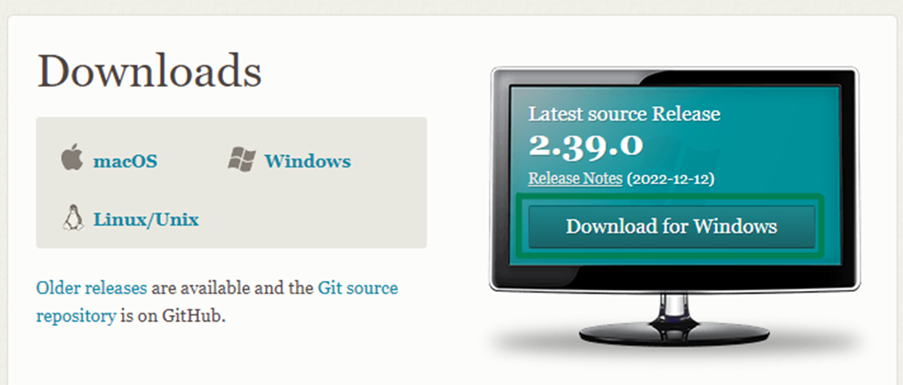

### Esse é um guia prático sobre Git e Github.
 

Git é um conceito importante, tanto para project-side quando para projetos profissionais. O mesmo é basicamente um sistema de versionamento de arquivos, onde podemos volta a alguma alteração do código é possível trabalhar em equipe ou sozinho.

Já GitHub é uma plataforma para hospedagem de arquivos que estão sofrendo esses versionamentos.

## Baixando de instalando o git.

* Acesse: [Git Downloads](https://git-scm.com/downloads) e inicie o download.

* Prossiga com a instalação. Exemplo passo a passo abaixo:

## Comandos iniciais de configurações do git:
Antes de começarmos, é interessante verificar se o git está instalado corretamente em sua maquina. Para isso execute em seu terminal: `git --version`.

Estará tudo certo para próximos passo, se houver  um retorno dizendo a versão do git. É preciso definir as seguintes configurações:
* Definindo nome de usuário: `git config --global user.name “Seu Nome”`
* Definindo e-mail: `git config --global user.name “Seu Nome”`
* Definindo o editor de código: `git config --global core.editor nomeEditor`

Verificando configurações definidas: 
* `git config user.name` - Nome de usuário.
* `git config user.email` - E-mail.
* `git config core.editor` - Editor de código.
* `git config --list` - Outras informações.

## Conectando repositório local ao remoto.
Para podermos fazer a migração do repositório local ao remoto precisamos gerar uma SSH KEY e para isso é necessário entrar no terminal do git bash (que já foi instalado juntamente com o git).
* [Aqui está o guia para gerar chave SHH](https://docs.github.com/pt/authentication/connecting-to-github-with-ssh/generating-a-new-ssh-key-and-adding-it-to-the-ssh-agent).

Mas basicamente é acessar o git bash e inserir os comandos:
* `sshkeygen -t rsa 4096 -C seuEmail@exemplo.com` (Precisa ser seu e-mail do github). 

Seu retorno será: 
* `Generating public/private ALGORITHM key pair`, de enter.
* `Enter a file in which to save the key (/c/Users/YOU/.ssh/id_ALGORITHM):[Press enter]`, de enter.
* `Enter passphrase (empty for no passphrase): [Type a passphrase]`, de enter (Crie ou não crie uma senha).
* `Enter same passphrase again: [Type passphrase again]`, de enter (Se criou uma senha, digite novamente).

Adicionando uma nova chave SSH à sua conta do GitHub:
* [Aqui está o guia para adicionar chave SHH no GitHub](https://docs.github.com/pt/authentication/connecting-to-github-with-ssh/generating-a-new-ssh-key-and-adding-it-to-the-ssh-agent).
* Acesse: '/c/Users/YOU/.ssh/id_ALGORITHM' e abra o arquivo 'id_rsa.pub' com bloco de notas e copie sua chave SSH. 

Agora no GitHub, siga as instruções nas imagens abaixo: 

E por último. Se solicitado, confirme acesso à sua conta em GitHub, após isso já estamos prontos para usar o git.

## Iniciando projetos com o git.

Antes de apresentar os comandos a você irei explicar sobre os conceitos "master" e "branch". 
* Master/main é a versão principal do projeto.
* Branch é alguma ramificação (versão diferente) do projeto principal.

Após entender isso, abra seu projeto pelo terminal do git bash, ou acesse o terminal dentro do seu editor de código. Com essa última opção é interessante utilizar a extensão "Terminal", caso use o VS CODE.

É possível acessar de forma rápida o terminal clicando nesse icon, na parte inferior do VS CODE:

## Comandos do git:
Abaixo disponibilizo os comandos mais usado e necessários: 
* `git init` - Para iniciar um repositório e é possivel dar inicio em projetos, seja ele vazio ou já desenvolvidos.
* `git status` - Para verificar se alguma alteração.
* `git log` - Para ver todos os commit já feito.
* `git add -A` - Para adicionar arquivos ao monitoramento do git.
* `git add arquivo` - Para adicionar arquivo especifico ao monitoramento do git. 

 

* `git commit -m "algumComentário"` - Para enviar alterações do projeto para o git.
* `git commit -am "algumComentário"` - Para adiciona e commitar as alterações ao mesmo tempo.

 

* `git branch` - Para verificar em qual ramificação se está.
* `git branch "nomeBranch"` - Para criar uma nova ramificação.
* `git branch -M "nomeNovo"` - Para renomear branch.
* `git branch -D nomeBranch` - Para deletar branch localmente.

 

* `git checkout nomebranch` - Para mudar de branch.
* `git checkout -b "nomeBranch"` - Para criar nova branch e já entrar na mesma.
* `git checkout HEAD -- "nomeArquivo"` - Para voltar a alguma alteração de um arquivo especifico.

 

* `git push -u origin branch` - Para enviar repositório local para o github.
* `git push origin :nomeBranch` - Para deletar branch remotamente.

 

* `git reset -soft codigoCommit` - Para voltar a algum commit que é necessário dar git commit.
* `git reset -mixed codigoCommit` - Para voltar a algum commit que é necessário dar git add.
* `git reset --hard codigoCommit` - Para voltar totalmente a algum commit.

  

* `git diff` - Para saber o que foi alterado no codigo.
* `git diff --name-only` - Para saber quais arquivos foi alterado.
* `git diff nomeArquivo` - Para saber o que foi alterado em um arquivo especifico.

 

* `git remote add origin linkRepositório` - Para hospedar o projeto que está localmente no github.
* `git revert  --no-edit codigoCommit` - Para reverter apenas alterações de algum commit. 
* `git clone linkRepositorio` - Para clonar um repositório.
* `git marge <branch>` - Para a junção de duas ou mais branch ao mesmo tempo.
* `git pull origin <branch>`- Para puxar o que está no repositório github para sua maquina. 

## Na prática: 

## Finalização.