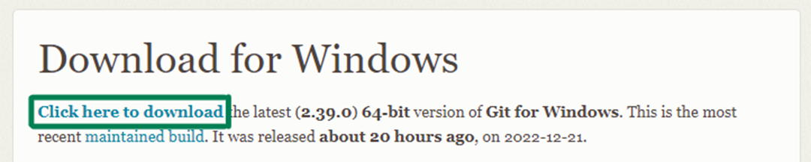

Git é um conceito importante, tanto para project-side quando para projetos profissionais. O mesmo é basicamente um sistema de versionamento de arquivos, onde podemos volta a alguma alteração do código sendo possível trabalhar em equipe ou sozinho.

Já o GitHub é uma plataforma para hospedagem de arquivos que estão sofrendo esses versionamentos.

## Baixando e instalando o Git.

* Acesse: [Git Downloads](https://git-scm.com/downloads), inicie o download e prossiga com a instalação.

* Passo a passo abaixo:

* Após isso, execute o instalador e siga o processo.

Antes de começarmos, é interessante verificar se o Git está instalado corretamente em sua maquina. Para isso execute em seu terminal: `git --version`.

## Comandos iniciais de configuração do git:

Estará tudo certo para próximos passos, se houver  um retorno dizendo a versão do Git. Logo é preciso definir as seguintes configurações:
* Nome de usuário, execute: `git config --global user.name “Seu Nome”`
* E-mail, execute: `git config --global user.name “Seu Nome”`
* Editor de código, execute: `git config --global core.editor nomeEditor`

E para verificar as configurações definidas execute: 
* `git config user.name` - Nome de usuário.
* `git config user.email` - E-mail.
* `git config core.editor` - Editor de código.
* `git config --list` - Outras informações.

## Conectando repositório local ao remoto.
Para podermos fazer a migração do repositório local ao remoto precisamos gerar uma SSH KEY e para isso é necessário acessar o terminal Git Bash (que já foi instalado juntamente com o Git).
* [Aqui está o guia para gerar sua chave SSH](https://docs.github.com/pt/authentication/connecting-to-github-with-ssh/generating-a-new-ssh-key-and-adding-it-to-the-ssh-agent).

* Mas basicamente é acessar o Git Bash e inserir o comando: `sshkeygen -t rsa 4096 -C seuEmail@exemplo.com` (Seu e-mail do GitHub). 

Seu retorno será: 
* `Generating public/private ALGORITHM key pair`, de enter.
* `Enter a file in which to save the key (/c/Users/YOU/.ssh/id_ALGORITHM):[Press enter]`, de enter.
* `Enter passphrase (empty for no passphrase): [Type a passphrase]`, de enter (Crie ou não crie uma senha).
* `Enter same passphrase again: [Type passphrase again]`, de enter (Se criou uma senha, digite ela novamente).

Adicionando sua chave SSH à sua conta do GitHub:
* [Aqui está o guia para adicionar chave SSH no GitHub](https://docs.github.com/pt/authentication/connecting-to-github-with-ssh/generating-a-new-ssh-key-and-adding-it-to-the-ssh-agent).

* Mas basicamente é acessar: `C:/Users/YOU/.ssh`, abrir o arquivo 'id_rsa.pub' com bloco de notas ou seu editor de código e copiar sua chave SSH. 

Agora acesse sua conta GitHub e siga as instruções abaixo: 

* Acesse `Settings`, após clicar na sua foto de perfil.

* Na seção `Access`, clique em `SSH and GPG Keys`.

* Após, clique em `New SSH key`.

* Insira um título para essa chave em `Tittle`, cole sua chave SSH em `Key` e prossiga clicando em `Add SSH key`.

E por último. Se solicitado, confirme acesso à sua conta em GitHub, após isso já estamos prontos para usar o Git juntamente com o GitHub.

## Iniciando projetos com o Git.

Antes de apresentar os comandos a você irei explicar os conceitos "master" e "branch". 
* Master/main é a branch principal do projeto.
* Branch é alguma ramificação (versão) do projeto principal.
* Após entender isso, abra seu projeto pelo terminal do Git Bash, ou acesse o terminal dentro do seu editor de código. Com essa última opção é interessante utilizar a extensão "Terminal", caso use o VS CODE.

* Com ela instalada é possível acessar de forma rápida o terminal clicando nesse icon, que fica na parte inferior do VS CODE:

## Comandos do Git:
Abaixo disponibilizo os comandos mais usado: 
* `git init` - Para iniciar um repositório e é possível dar inicio, seja ele um projeto vazio ou já desenvolvido.
* `git status` - Para verificar se alguma alteração.
* `git log` - Para ver todos os commits já feito.
* `git add -A` - Para adicionar arquivos ao monitoramento do Git.
* `git add arquivo` - Para adicionar arquivo especifico ao monitoramento do Git. 

 

* `git commit -m "algumComentário"` - Para enviar alterações do projeto para o Git.
* `git commit -am "algumComentário"` - Para adicionar e commitar as alterações ao mesmo tempo no Git.

 

* `git branch` - Para verificar em qual ramificação se está.
* `git branch "nomeBranch"` - Para criar uma nova ramificação.
* `git branch -M "nomeNovo"` - Para renomear branch.
* `git branch -D nomeBranch` - Para deletar branch localmente.

 

* `git checkout nomebranch` - Para mudar de branch.
* `git checkout -b "nomeBranch"` - Para criar nova branch e já entrar na mesma.
* `git checkout HEAD -- "nomeArquivo"` - Para voltar a alguma alteração de um arquivo especifico.

 

* `git push -u origin branch` - Para enviar repositório local para o GitHub.
* `git push origin :nomeBranch` - Para deletar branch remotamente.

 

* `git reset -soft codigoCommit` - Para voltar a algum commit que é necessário dar commit.
* `git reset -mixed codigoCommit` - Para voltar a algum commit que é necessário dar add.
* `git reset --hard codigoCommit` - Para voltar totalmente a algum commit.

  

* `git diff` - Para saber o que foi alterado no código.
* `git diff --name-only` - Para saber quais arquivos foram alterado.
* `git diff nomeArquivo` - Para saber o que foi alterado em um arquivo especifico.

 

* `git remote add origin linkRepositório` - Para hospedar algum projeto no GitHub.
* `git revert  --no-edit codigoCommit` - Para reverter apenas alterações de algum commit. 
* `git clone linkRepositorio` - Para clonar um repositório.
* `git marge <branch>` - Para a junção de duas ou mais branch ao mesmo tempo.
* `git pull origin <branch>`- Para puxar o que está no repositório GitHub para sua maquina. 

## Finalização.
Bom, chegamos ao final desse guia prático e espero que ele tenha ajudado você. Caso ficou alguma dúvida, entre em contato comigo pelo [Instagram](https://www.instagram.com/mayconviniciusdev/).

Relembrando que existem diversas outras funcionalidade do Git e GitHub, porém com tudo isso apresentado você já conseguirá desenvolver um projeto com essa tecnologia. 

Em breve irei adicionar uma seção de como usar na prática. Então, até mais.